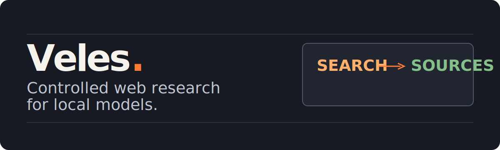
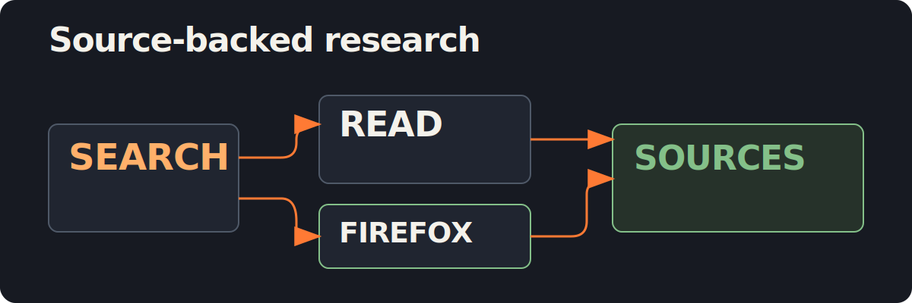

# Veles

<p align="center">
  
</p>

Veles is a local Rust-based MCP server for local LLMs that need controlled access to web search and page content. It searches DuckDuckGo, reads public pages, and returns structured sources for research-style prompts.

## What You Get

- **Local MCP over stdio** with no API key required.
- **Web search and source collection** through DuckDuckGo HTML and DuckDuckGo Lite fallbacks.
- **Readable page retrieval** through `web_fetch`, `web_extract`, and `web_read`.
- **Opt-in Firefox rendering** for JavaScript-heavy pages through `web_read_rendered`.
- **Safety-first defaults**: public HTTP/HTTPS only, obvious local and private targets blocked, bounded redirects and responses, and a global outbound rate limit.

## How It Works

<p align="center">
  
</p>

Veles does not synthesize final answers. It returns structured sources, excerpts, URLs, and warnings for the calling LLM to use as data.

## Quick Start

Install Rust with rustup:

```bash
curl --proto '=https' --tlsv1.2 -sSf https://sh.rustup.rs | sh
. "$HOME/.cargo/env"
```

Build the release binary:

```bash
cargo build --release
```

The binary is available at `target/release/veles`.

To build Veles and register a disabled local MCP entry for OpenCode:

```bash
./scripts/install-opencode.sh
```

Set `enabled` to `true` in your OpenCode configuration when you want OpenCode to start Veles.

## Use With OpenCode

You can override the configuration path with `OPENCODE_CONFIG=/path/to/opencode.json ./scripts/install-opencode.sh`.

Manual configuration:

```jsonc
{
  "$schema": "https://opencode.ai/config.json",
  "mcp": {
    "veles": {
      "type": "local",
      "command": ["/absolute/path/to/veles", "--stdio"],
      "enabled": false,
      "timeout": 120000,
      "environment": {
        "VELES_REQUESTS_PER_SECOND": "1",
        "VELES_CACHE_TTL_SECONDS": "3600",
        "VELES_DDG_REGION": "wt-wt",
        "VELES_SAFESEARCH": "moderate",
        "VELES_BROWSER_ENABLED": "false",
        "VELES_BROWSER_DRIVER": "geckodriver",
        "VELES_BROWSER_HEADLESS": "true",
        "VELES_BROWSER_PAGE_TIMEOUT_MS": "90000",
        "VELES_BROWSER_SETTLE_MS": "2000"
      }
    }
  }
}
```

Use the absolute path to `target/release/veles` or to any installed copy of the binary.

## Use With LM Studio

In LM Studio, open the `Program` tab, choose `Install`, then choose `Edit mcp.json`. Add Veles as a local stdio MCP server and point `command` to the compiled binary:

```jsonc
{
  "mcpServers": {
    "veles": {
      "command": "/absolute/path/to/veles",
      "args": ["--stdio"],
      "env": {
        "VELES_REQUESTS_PER_SECOND": "1",
        "VELES_CACHE_TTL_SECONDS": "3600",
        "VELES_DDG_REGION": "wt-wt",
        "VELES_SAFESEARCH": "moderate"
      }
    }
  }
}
```

If your LM Studio version uses a different UI for MCP registration, choose a local stdio server and use the same command, arguments, and environment variables.

Recommended LM Studio settings:

- Server name: `veles`.
- Command: absolute path to `target/release/veles`.
- Arguments: `--stdio`.
- Environment: keep `VELES_REQUESTS_PER_SECOND=1` unless you intentionally want a higher global request rate.

## MCP Tools

| Tool | Purpose |
| --- | --- |
| `current_datetime` | Returns local and UTC time from the system clock without using the internet. |
| `web_search` | Searches DuckDuckGo and returns result titles, URLs, snippets, and warnings. It falls back from DuckDuckGo HTML to DuckDuckGo Lite before returning an empty list with warnings. |
| `web_fetch` | Fetches a public HTTP/HTTPS page and returns text plus response metadata. Non-success HTTP statuses are structured results, not MCP errors. |
| `web_extract` | Fetches a page and extracts readable Markdown-like text and metadata. |
| `web_read` | Returns cleaner LLM-friendly Markdown with metadata, links, and a truncation flag. |
| `web_read_rendered` | Reads JavaScript-heavy pages through Firefox after browser opt-in. |
| `web_research` | Searches, fetches top results, extracts text, and returns source excerpts. Individual source failures do not fail the whole workflow. |

## Safety By Default

- Veles permits only `http://` and `https://` URLs and blocks localhost, local IPs, private IPs, link-local IPs, and unsupported schemes by default.
- The default global outbound rate is one request per second; redirects and response sizes are bounded.
- Browser rendering is disabled by default. Its first call requires `allow_browser=true`, then consent lasts only until the server restarts.
- Treat all fetched and rendered page content as untrusted input. A page can contain prompt-injection text intended to influence the model.
- Veles blocks obvious local and private targets, but it is not a complete sandbox. Do not expose it to untrusted remote users.

<details>
<summary><strong>Configuration reference</strong></summary>

Veles is configured with environment variables:

| Variable | Default | Description |
| --- | --- | --- |
| `VELES_REQUESTS_PER_SECOND` | `1` | Global outbound HTTP request rate. |
| `VELES_CACHE_TTL_SECONDS` | `3600` | In-memory cache TTL. |
| `VELES_REQUEST_TIMEOUT_MS` | `15000` | HTTP request timeout. |
| `VELES_MAX_PAGE_BYTES` | `2000000` | Maximum response size. |
| `VELES_DDG_REGION` | `wt-wt` | DuckDuckGo region parameter. |
| `VELES_SAFESEARCH` | `moderate` | `strict`, `moderate`, or `off`. |
| `VELES_USER_AGENT` | `Veles/0.5 local MCP server` | HTTP user agent. |
| `VELES_BROWSER_ENABLED` | `false` | Enable Firefox/geckodriver rendering for `web_read_rendered`. |
| `VELES_BROWSER_DRIVER` | `geckodriver` | Browser WebDriver executable path or command. |
| `VELES_FIREFOX_BINARY` | unset | Optional Firefox binary path. |
| `VELES_BROWSER_HEADLESS` | `true` | Run Firefox headless by default. |
| `VELES_BROWSER_PAGE_TIMEOUT_MS` | `90000` | Browser page load and startup timeout. |
| `VELES_BROWSER_SETTLE_MS` | `2000` | Extra wait after page load before reading rendered DOM. |

</details>

<details>
<summary><strong>Firefox rendering</strong></summary>

`web_read_rendered` is for JavaScript-heavy pages that do not expose useful content through plain HTTP fetching. It uses Firefox through geckodriver, creates a temporary private profile for each call, reads the rendered DOM, then closes the browser session and geckodriver process.

Requirements:

- Install Firefox.
- Install `geckodriver` and ensure it is available in `PATH`, or set `VELES_BROWSER_DRIVER` to its absolute path.
- Set `VELES_BROWSER_ENABLED=true`.

The first browser call in each Veles process requires explicit permission. A call without `allow_browser=true` returns `needs_browser_permission: true` and does not launch Firefox. After the user approves, retry the same tool call with `allow_browser=true`; Veles remembers that consent in memory until the MCP server restarts.

Firefox runs headless by default. Set `VELES_BROWSER_HEADLESS=false` or pass `headless: false` to `web_read_rendered` if you want to see the browser window.

</details>

<details>
<summary><strong>DuckDuckGo notes</strong></summary>

Veles uses unofficial DuckDuckGo HTML parsing. This requires no API key, but it is not a stable public API. It is suitable for local personal use, not high-volume production search.

If DuckDuckGo changes its HTML or blocks automated traffic, `web_search` may return an empty result list with warnings. Veles first tries DuckDuckGo HTML search, then DuckDuckGo Lite.

</details>

## Limits

- Browser rendering requires Firefox, geckodriver, and `VELES_BROWSER_ENABLED=true`.
- Rendered pages do not expose reliable HTTP status codes through WebDriver.
- DuckDuckGo parsing is unofficial and can break if DuckDuckGo changes its HTML.
- DuckDuckGo may still return 429, CAPTCHA, or temporary blocks under automated load.

## Roadmap

- Improve DuckDuckGo resilience against markup changes and temporary blocks.
- Add more robust readable-content extraction.
- Add package and install scripts for more MCP clients.

## License

Veles is licensed under the MIT License.
